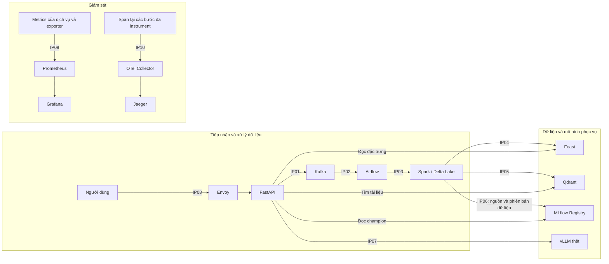

# Kiến trúc và trách nhiệm — Day 28, Track 2

Bài làm cá nhân của Nguyễn Quang Hà. Sơ đồ mô tả kiến trúc trong repo của bài thực hành; trạng thái hoạt động thực tế được ghi riêng trong hồ sơ kiểm tra.

## Luồng hệ thống

Các mũi tên thể hiện hợp đồng tích hợp. IP06 là release gắn nguồn dữ liệu Delta, không phải một task tự huấn luyện mô hình trong DAG. Metrics Kafka đi qua `kafka-exporter`, batch metrics qua Pushgateway; metric MLflow trong cấu hình được lấy từ API exporter. Các span quanh lời gọi dịch vụ có thể do client phát ra, không đồng nghĩa mỗi dịch vụ tự có một tracing SDK riêng.

## Mười điểm kết nối

| Điểm | Điều cần giải thích và chứng minh | Vai trò phụ trách |
|---|---|---|
| IP01 | Event từ API tới `data.raw`, payload và header giữ khóa chống trùng cùng trace context | Ingestion |
| IP02 | DAG đọc Kafka, có run ID, task state, retry/DLQ và asset event | Ingestion |
| IP03 | Spark MERGE theo `idempotency_key`; đối chiếu version, schema và số dòng khi replay | Data & ML |
| IP04 | Xuất snapshot từ Delta, materialize rồi đọc đúng entity và bốn feature của `asker_activity_v1` | Data & ML |
| IP05 | Document từ Delta được index bằng UUID ổn định theo `doc_id`; truy vấn có kết quả | Serving |
| IP06 | Release có provenance, signature, version và alias `champion`; thử promotion/rollback | Data & ML |
| IP07 | Endpoint thật cung cấp `/version`, `/v1/models`, metric `vllm:` và completion có ID đối chiếu | Serving |
| IP08 | Envoy định tuyến, có `x-request-id`, trả 200/429 và chuyển tiếp health/readiness | Platform |
| IP09 | Targets đúng cấu hình, dashboard có dữ liệu và alert có thể xử lý | Platform |
| IP10 | Truy vấn backend bằng trace ID và tìm đủ span yêu cầu; kiểm tra riêng nhánh LangSmith khi có cấu hình | Platform |

Nguyễn Quang Hà phụ trách cả bốn nhóm kỹ thuật trên và phần chuẩn bị demo. Kết quả thực thi và các giới hạn của môi trường được ghi trong submission/README.md.

## Những chi tiết cần trình bày đúng với mã nguồn

DAG `lab28_ingestion_pipeline` được trigger thủ công (`schedule=None`), có tối đa một run đồng thời. Bốn task là `drain_kafka_into_delta`, `refresh_online_features`, `index_new_documents` và `announce_processed_batch`. Hai task cập nhật Feast/Qdrant nhận kết quả ghi Delta; task cuối phát `data.processed` khi các nhánh hoàn tất.

Consumer commit offset sau khi phần ghi Delta thành công. Điều đó không có nghĩa Feast và Qdrant đã cập nhật xong tại thời điểm commit; khi lỗi xảy ra ở các task sau, cần kiểm tra và khôi phục các task tương ứng.

API hiện chọn Kafka record key theo `entity_id`, còn `idempotency-key` nằm trong header/payload và là khóa MERGE. Integration matrix lại mô tả record key là `idempotency_key`; J1 kiểm tra record key bằng `asker_id`. Đây là điểm chưa thống nhất trong tài liệu khung, cần làm rõ trước khi đổi hợp đồng.

Các cổng host mặc định gồm Envoy 8080, API 8000, Airflow 8082, Feast 6566, Feast metrics 6570, Qdrant 6333, MLflow 5000, vLLM 8001, Prometheus 9090, Grafana 3000 và Jaeger 16686. Cổng metrics của Feast trong container là 8000, khác cổng feature server 6566.

IP10 yêu cầu 11 **tên span**, không phải 11 dịch vụ. Cấu hình Collector hiện xuất trace tới Jaeger và debug; chưa có exporter LangSmith. Chỉ đặt API key chưa đủ để khẳng định nhánh LangSmith đã hoạt động.
